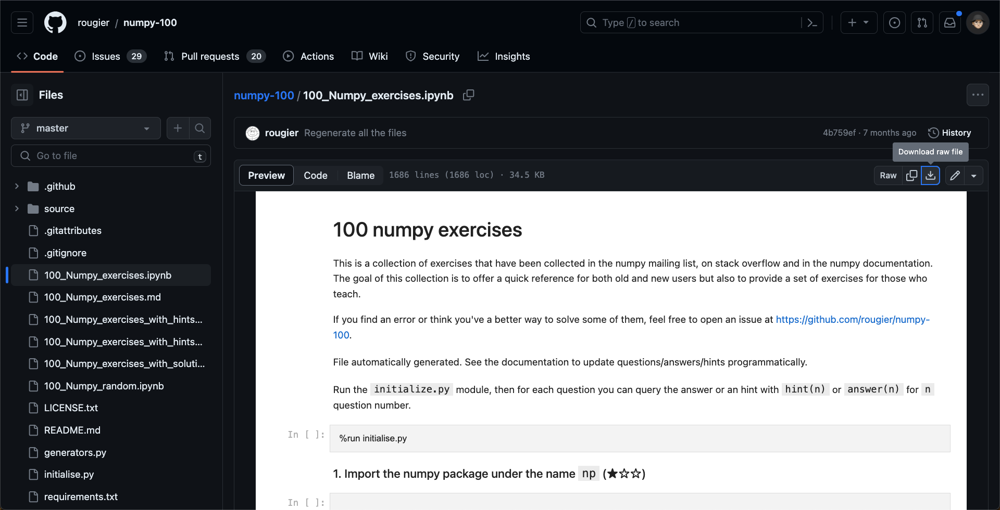
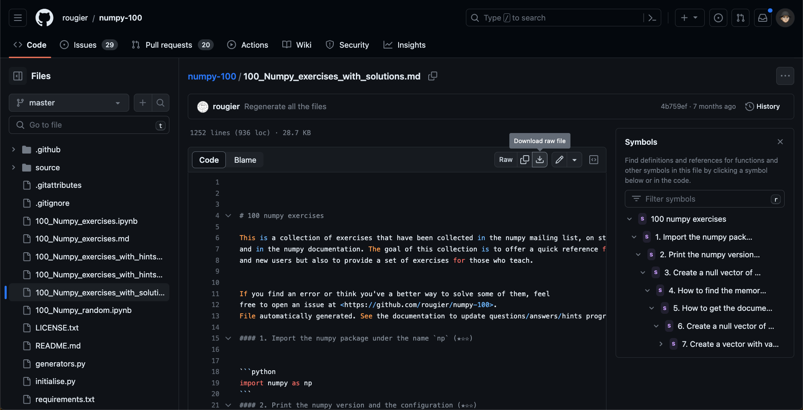

# [AP4063 Weather and Artificial Intelligence Ⅰ] 23 Fall  Numpy Practice Answers from TA

> AP4063 - Weather and Artificial Intelligence Ⅰ **Midterm**  
>
> **Year: 2023 Fall**  
> **Lecturer: Che-Wei Chou (周哲維)**  
> **TA: Hugo ChunHo Lin (林群賀)**
>    
> </aside>

## About Numpy 100 Download Resources

After the class on October 5, 2023, some students inquired about the source and how to download the "Numpy 100" exercises. I have compiled the sources and instructions for you all (which can be downloaded via the attachment or from GitHub).
 
Exercise Link: https://github.com/rougier/numpy-100/blob/master/100_Numpy_exercises.ipynb

 
You can simply click on the link to download the exercises to your local machine. If you don't have a Python environment locally, you can upload the exercises to Google Colab and start working on them there.
 
Solution Link: https://github.com/rougier/numpy-100/blob/master/100_Numpy_exercises_with_solutions.md

 
Similarly, you can click on the link to download and refer to the solutions provided.
 
If you have any questions or need assistance, please feel free to contact me through any means available. Additionally, I have attached the Numpy 100 code (100_Numpy_solved_by_TA.ipynb) that I previously wrote for your reference while answering the exercises.
 
Wishing everyone success in all your endeavors!
 
TA Hugo ChunHo Lin